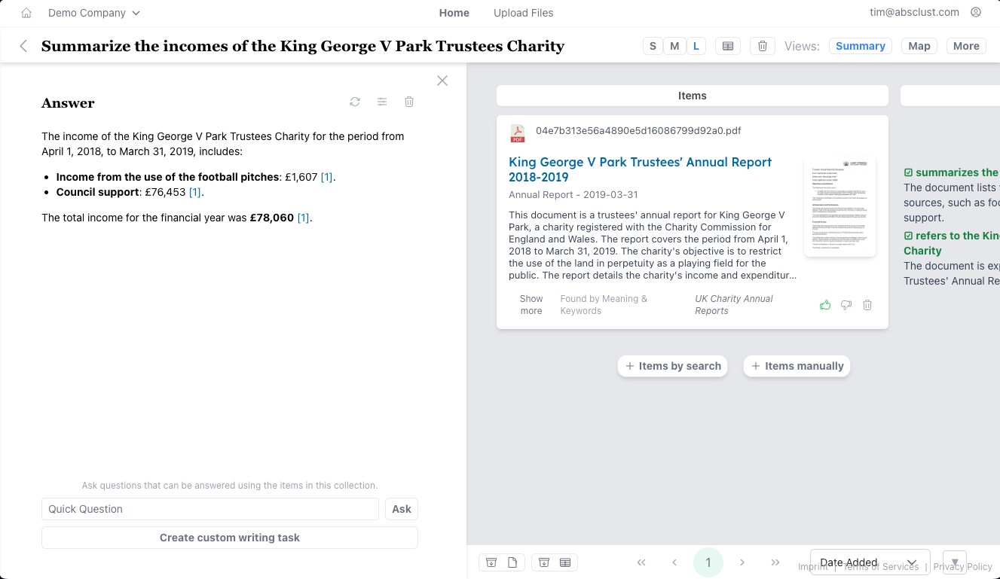

# Quiddity InsightHub

This is a Python-Django-backend, Vue-frontend tool to visualize, search, organize and extract data.

As of April 2025, this is the **only open source (and even proprietary) tool** that combines:
- AI question answering (knowledge management): advanced RAG system + PDF / document processing to answer questions
- AI search: show lists of results (not just summarized answers) using the latest AI search features (hybrid keyword + vector search, reranking, individual result checking using LLM etc.)
- AI smart tables: extract data interactively from documents in a tabular interface and automate whole workflows (think of V7 Go, the new Microsoft SharePoint auto-fill columns etc.)
- AI visual data maps: using dimensionality reduction and smart cluster titles to create interactive maps of any data (e.g. to understand your machine learning training data set, find patterns in result sets etc.)

This is done using a combination of the following **techniques**:
- custom developed document processing (see PDFerret, extracting information from documents like PDFs, xlsx, docx, CAD files etc. using Vision Language Models like Pixtral in combination with traditional tools like Tika and Grobid, ability to pre-process documents offline using LLMs to e.g. generate summaries and tags)
- production-ready embedding generation pipeline (overcoming downsides of 'simple' embedding generation: generate multiple embeddings per document, add new embedding types at runtime without changing the database structure, generate hundreds of millions of embeddings efficiently)
- adaptability to any data structure or even existing OpenSearch / ElasticSearch indexes without reingestion of the data (using "Data Schemas", describing the structure and rendering of the data)
- architecture to combine all state-of-the-art techniques for AI-based search plus agentic behavior in a clear and explainable data structure (tracking and making every step explainable and changable by the user: from vector search, over evaluating individual documents using LLMs, selecting the most relevant ones, iterating searches using agents to generating the final answer (editable by the user) including references)
- GPU-accelerated generation of embedding maps using UMAP in milliseconds
- mixed-language support, not just English (language-specific embedding models and prompts, settings for language of offline generated per-document summaries + metadata, mixed languages in tables e.g. to translate documents on-the-fly)

**Main features:**
- ingest data, convert it to embeddings and index it automatically
- generate visual maps of data
- create collections of data, use them to recommend more items using active learning
- create tables of data and extract information from each item using LLMs
- chat with the data and answer questions

-> a "funnel" from massive data amounts to a curated set of items with extracted information

**Tested Use Cases:**
- AbsClust: paper search engine for 100M+ scientific papers [v2.absclust.com](v2.absclust.com)
- enterprise knowledge management: tested with an international company for thousands of documents, including technical drawings and project plans in English and German
- tender search platform: cooperation with IT agency to build a platform to search and curate public tenders in Germany [tenders.enda.eu](tenders.enda.eu)
- e-commerce product search engine: prototype to search for product using natural language and showing results on a visual map
- perplexity-like internet search and summaries
- web page scraping and information extraction for lead generation, job search, real estate property evaluation etc. in a tabular interface
- extracting specific data from patents in a table, automating the workflow to screen patents e.g. for innovation scouts

### Screenshots and Videos

## Status and Security

**Status:** The InsightHub works and when configured correctly, it can provide value in a real life setting.
But the project and codebase is still in alpha stage, i.e. not everything is properly documented, some features might not work as expected or are not even implemented.

**Maintenance:** The project is not maintened actively at the moment. Let us know if you are interested in maintaining it or paying for maintenance.

**Security:** Currently, the system is not meant for production use. There are several major security issues with the current set up, e.g. using the vite and Django development webservers instead of a production server like gunicorn. Even though the databases are not exposed to the outside, the connections should not use default passwords as currently. Lastly, the API does not use authentication for every endpoint yet, and even the endpoints that use it are not tested for security.

In total, the project can provide value e.g. in a controlled environment like an intranet, and many issues can be solved rather easily, but it should not be used exposed to the internet and with confidential data at the moment.

## Running the system

- install docker >= v24.0 (and nvidia-docker if an Nvidia GPU is available, test the GPU setup with a simple container)
- check out the git repository
- create a `.env` file according to the variables listed in [required_environment_variables.txt](required_environment_variables.txt)
- add `docker-compose.override.pdferret.yaml` to your `COMPOSE_FILE` env variable (colon separated) if you want to be able to upload and parse PDF files (and other documents)
- run `docker compose up -d`
- go to `localhost:55140` and log in with e-mail `admin@example.com` and password `admin` (if not changed using env variables)
- visit the admin interface using the top right user menu and the "database" icon for more settings

### Things to try after initial installation

- Chat (if you added LLM API keys): create a new empty collection, click on "Summaries" at the top right, type in a question and press enter. You can use it like a classic ChatGPT chat.
- Upload PDF documents (if you added the PDFerret docker container + LLM API keys): click on "upload documents" on the top left -> "My Dataset" -> "+ Choose" to select files -> "Upload". You should then be able to search for those documents in new collections.

### Upload your own data via Upload

You can upload individual files as well as .zip files with multiple files in the user interface.
You can also upload CSV files with multiple entries for some dataset schemas (e.g. scientific documents).

### Upload your own data via API

You can upload individual files or arbitrary JSON documents with your own data using the API.
See the folder `scripts_and_examples/import_scripts` for examples (some might be outdated, check `import_local_german_files.py` first).

TODO: create more documentation and improve API to upload data

### Updating the system

Not tested yet, but should work like this:

- `git pull`
- `docker compose down backend webserver`
- `docker compose up -d --build backend`
- `docker compose up -d --build webserver`

### Further Setup Configuration

- Data storage: By default, a docker volumes are used to store data like uploaded files and the database content. Override the docker volume setup to change this.
- GPU: The system can work without a GPU. If an Nvidia GPU is available, add `docker-compose.override.gpu.yaml` to your COMPOSE_FILE env variable (with a : after the other docker compose files). It enables GPU support for the containers to e.g. generate embeddings or maps using the GPU.
- To use Google LLMs, create a credentials file before building the Docker container using: `gcloud auth application-default login`, it will then be mounted to the container.
- see [required_environment_variables.txt](required_environment_variables.txt) for more settings

## Development Setup

Using the `docker-compose.override.dev.yaml` file, you get containers that are configured for a development setup, i.e. they mount this source folder into the container and have live reload enabled. This means that running `docker compose up -d` should ideally be enough to run the code, modify it and see changes immediately.

- If you want to hot-reload the front- and backend code, add `docker-compose.override.dev.yaml` to your COMPOSE_FILE env variable (with a : after the main docker compose file)
- (optionally) Set up VSCode by installing recommended extensions in `vsc-extensions.txt` (can be installed using `VSC Export & Import` extensions, but should be done carefully)

### Pre-commit

pre-commit usage is recommended. To install it run `pip install pre-commit` and then `pre-commit install`. This will ensure continuity of the code formatting.

### Development Notes

- The main structure and the level of high or low 'abstraction' is hopefully quite thought-through and should enable fast development, easy maintanability and high scalability where needed.
- Everything else is quite rudimental and the code is not very clean in many parts, just being there as a proof-of-concept.
  - Please change and improve wherever needed!
- Parts that need to be improved the most (especially before any public deployment):
  - [ ] User registration: currently, no e-mail verification is set up and access rights are not really managed.
  - many more...
