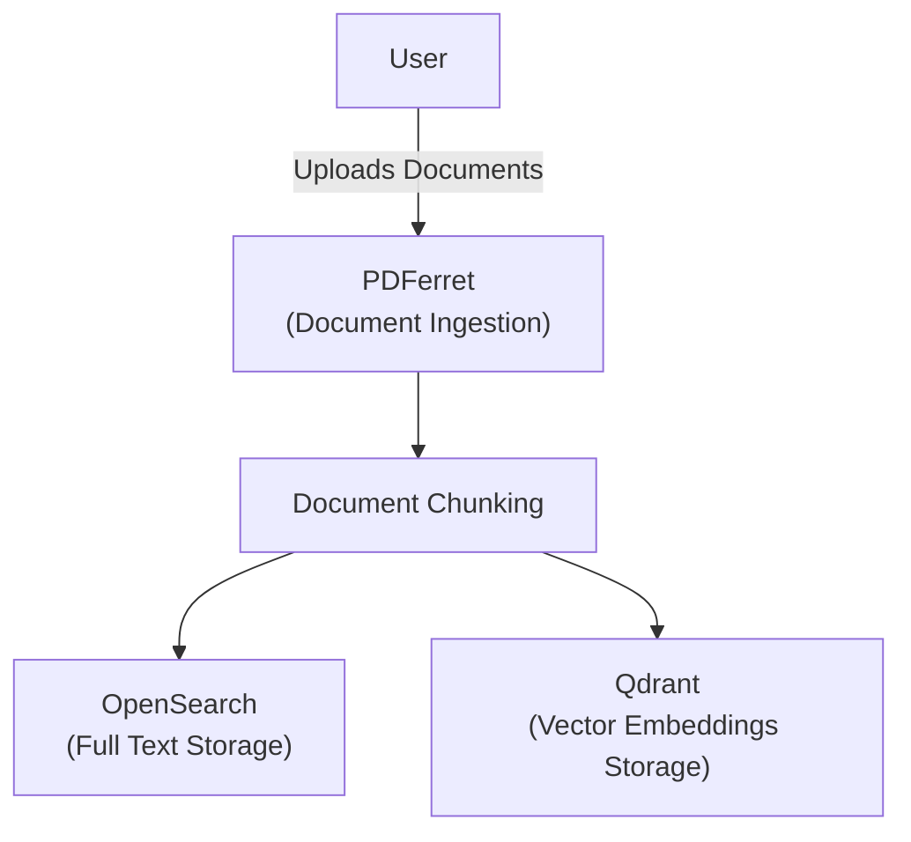
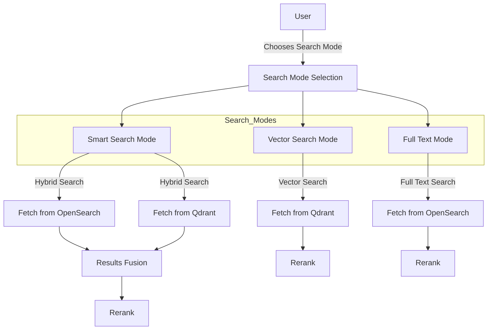
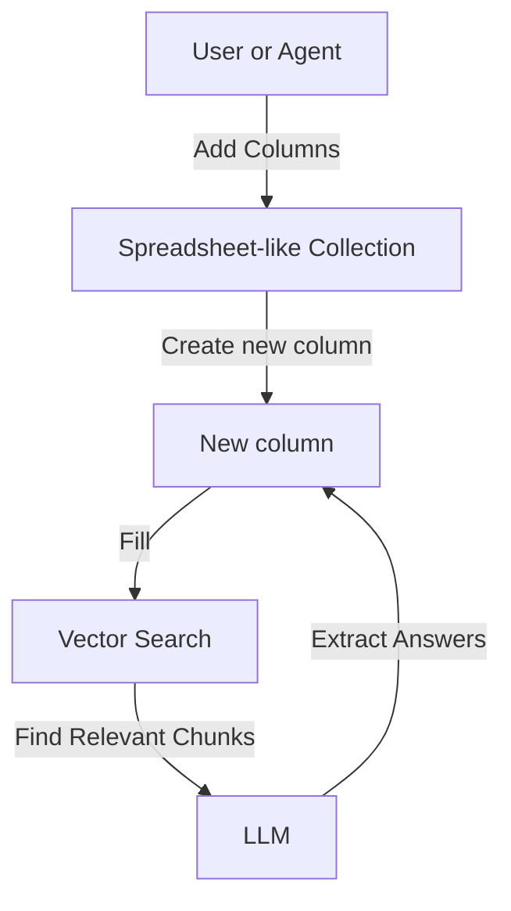

# Architecture Overview

## Document Ingestion
The document ingestion process is handled by [PDFerret](https://github.com/QuiddityAI/PDFerret), which is responsible for uploading and processing documents, including chunking. The chunked documents are stored in two different databases: OpenSearch for full-text storage and Qdrant for vector embeddings storage.

## Search Process
The search process begins with the user selecting a search mode (by default, hybrid search is used).
Depending on the selected mode, the system fetches results from either OpenSearch or Qdrant. The results are then fused and reranked to provide the final output.

## Collections and columns

The results are displayed in a spreadsheet-like collection. The user (or the agent) can add columns to this collection. The system then finds relevant chunks using vector search and utilizes an LLM with the column settings to extract answers, filling the respective columns.

