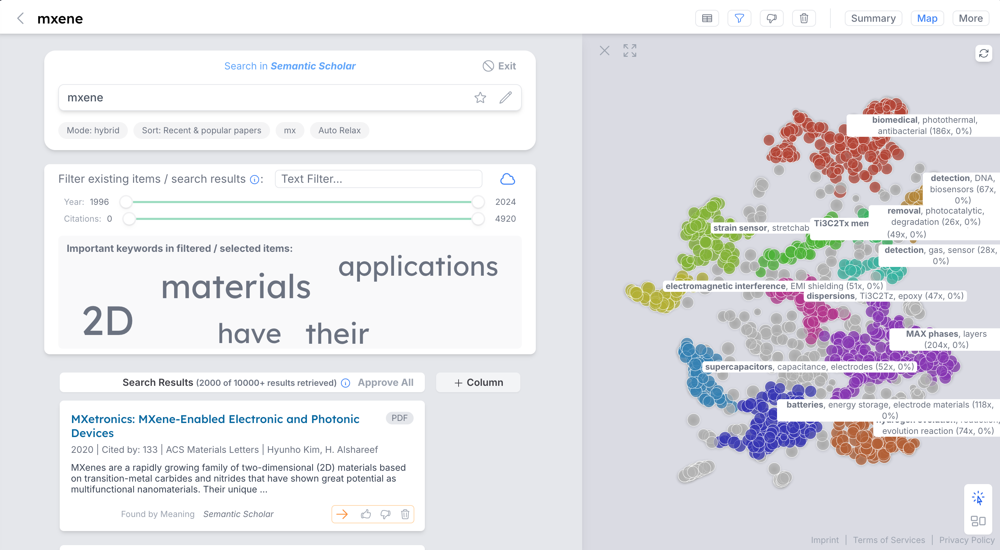

# What is InsightHub?

InsightHub is a tool to visualize, search, organize and extract data from documents and other data sources using the latest AI techniques. It is a combination of a document processing system, an AI search engine and a knowledge management system.

Built with Django-backend & Vue-frontend.

As of April 2025, this is the **only open source (and even proprietary) tool** that combines:

| Feature | Modality  | Description |
| ------------- | ------------- | ------------- |
| **AI Knowledge Management**  | Editable Textual Answer  | advanced RAG system + PDF / document processing to answer questions  |
| **AI Search**  | Interactive Result List  | show lists of results (not just summarized answers) using the latest AI search features (hybrid keyword + vector search, reranking, individual result checking using LLM etc.), create curate lists of results, add own notes to results, extract infos using LLMs etc.  |
| **AI Smart Tables**  | Interactive Table  | extract data interactively from documents in a tabular interface and automate whole workflows (think of V7 Go, the new Microsoft SharePoint auto-fill columns etc.)  |
| **AI Visual Data Maps**  | Interactive Map  | using dimensionality reduction and smart cluster titles to create interactive maps of any data (e.g. to understand your machine learning training data set, find patterns in result sets etc.)  |

This is done using a combination of the following **techniques**:

- custom developed **document processing** (see [PDFerret](https://github.com/QuiddityAI/PDFerret), extracting information from documents like PDFs, xlsx, docx, CAD files etc. using Vision Language Models like Pixtral in combination with traditional tools like Tika and Grobid, ability to pre-process documents offline using LLMs to e.g. generate summaries and tags)
- production-ready **embedding generation pipeline** (overcoming downsides of 'simple' embedding generation: generate multiple embeddings per document, add new embedding types at runtime without changing the database structure, generate hundreds of millions of embeddings efficiently)
- **adaptability to any data structure** or even **existing OpenSearch / ElasticSearch indexes** without reingestion of the data (using "Data Schemas", describing the structure and rendering of the data)
- architecture to combine all state-of-the-art techniques for **AI-based search** plus **agentic behavior** in a clear and explainable data structure (tracking and making every step explainable and changable by the user: from vector search, over evaluating individual documents using LLMs, selecting the most relevant ones, iterating searches using agents to generating the final answer (editable by the user) including references)
- GPU-accelerated generation of **embedding maps using UMAP** in milliseconds
- **mixed-language support**, not just English (language-specific embedding models and prompts, settings for language of offline generated per-document summaries + metadata, mixed languages in tables e.g. to translate documents on-the-fly)

**Main features:**

- ingest data, convert it to embeddings and index it automatically
- generate visual maps of data
- create collections of data, use them to recommend more items using active learning
- create tables of data and extract information from each item using LLMs
- chat with the data and answer questions

-> a "funnel" from massive data amounts to a curated set of items with extracted information

**Tested Use Cases:**

- AbsClust: paper search engine for 100M+ scientific papers [v2.absclust.com](https://v2.absclust.com)
- enterprise knowledge management: tested with an international company for thousands of documents, including technical drawings and project plans in English and German
- tender search platform: cooperation with IT agency to build a platform to search and curate public tenders in Germany [tenders.enda.eu](https://tenders.enda.eu)
- e-commerce product search engine: prototype to search for product using natural language and showing results on a visual map
- perplexity-like internet search and summaries
- web page scraping and information extraction for lead generation, job search, real estate property evaluation etc. in a tabular interface
- extracting specific data from patents in a table, automating the workflow to screen patents e.g. for innovation scouts

### Screenshots

///caption
Summarize a document and ask questions about it
///

///caption
View and extract data from documents in a table
///

///caption
Visual map of documents
///

### Videos

<video width="700" height="394" controls>
  <source src="videos/answer_questions_about_charity_income.mp4" type="video/mp4">
  Your browser does not support the video tag.
</video>
///caption
Answer question about documents
///

<video width="700" height="394" controls>
  <source src="videos/visual_overview_of_documents.mp4" type="video/mp4">
  Your browser does not support the video tag.
</video>
///caption
Generate visual maps
///

<video width="700" height="394" controls>
  <source src="videos/find_similar_docs.mp4" type="video/mp4">
  Your browser does not support the video tag.
</video>
///caption
Find similar documents
///

## Status and Security

**Status:** The InsightHub is functional and when configured correctly, it can provide value in a real life setting.
But the project and codebase are still in alpha stage, i.e. not everything is properly documented, some features might not work as expected or are not even implemented.

**Maintenance:** The project is not actively maintained at the moment. Let us know if you are interested in maintaining it or paying for maintenance / us it for your company.

**Security:** Currently, the system is not meant for production use. There are several major security issues with the current set up, e.g. using the vite and Django development webservers instead of a production server like gunicorn. The API does not use authentication for every endpoint yet, and even the endpoints that use it are not tested for security.

In total, the project can provide value e.g. in a controlled environment like an intranet, and many issues can be solved rather easily, but it should not be used exposed to the internet and with confidential data at the moment.

## Installation

see [installation.md](getting_started/installation.md) for detailed installation instructions

## Development Setup
see [development_setup.md](development/development_setup.md) for detailed development setup instructions

## License

This project is under Apache 2.0 License.
